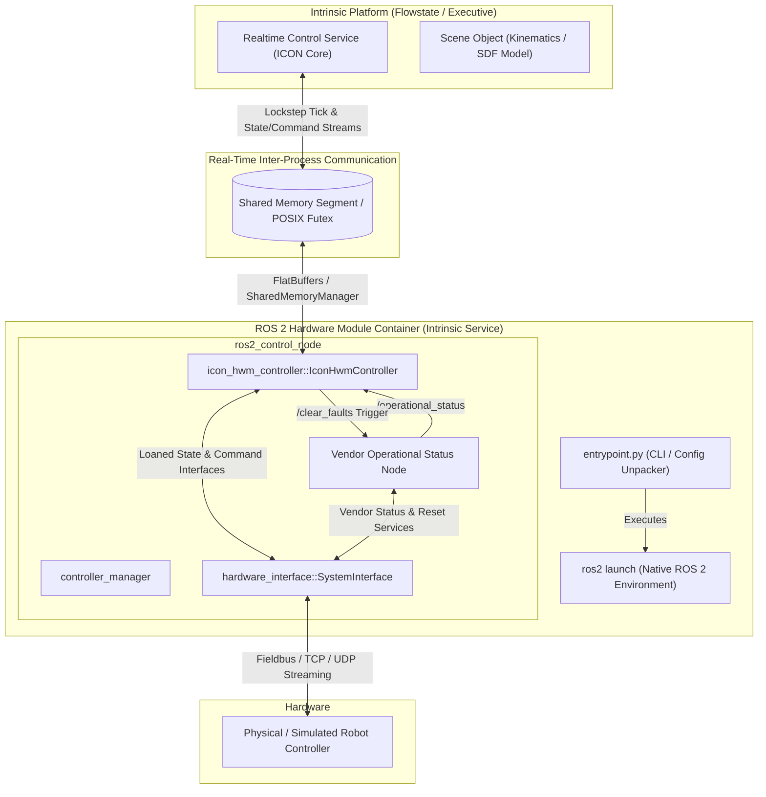

# ICON ROS 2 Control Hardware Module Controller

The **ICON ROS 2 Control Hardware Module Controller** (`icon_hwm_controller`) is an open-source bridge for [ROS 2 Control (ros2_control)](https://control.ros.org/kilted/index.html). It allows standard [ROS 2 Control Hardware Components](https://control.ros.org/kilted/doc/ros2_control/hardware_interface/doc/hardware_components_userdoc.html) (such as robot manipulators) to operate as [ICON Hardware Modules (HWM)](https://flowstate.intrinsic.ai/docs/apis/client_libraries/icon_extensions/custom_hardware_modules/) within the Intrinsic platform.

By packaging `ros2_control` drivers into hermetic [Intrinsic Services](https://flowstate.intrinsic.ai/docs/assets/create_new_assets/create_services/overview/) or combined [Intrinsic Hardware Devices](https://flowstate.intrinsic.ai/docs/guides/design_a_workcell/set_up_hardware_modules/overview/), developers can integrate physical or simulated industrial robots into [Flowstate](https://flowstate.intrinsic.ai/docs/guides/get_started/overview/) without writing proprietary drivers.

This repository targets **[ROS 2 Kilted Kaiju](https://docs.ros.org/en/kilted/index.html)** on **Ubuntu 24.04 (Noble)** and provides production-grade examples for:
* **[Universal Robots (UR)](icon_hwm_controller_examples/ur_ros2_icon_hwm/)** (UR3e, UR5e and UR10e) via the [`Universal_Robots_ROS2_Driver`](https://github.com/UniversalRobots/Universal_Robots_ROS2_Driver)
* **[FANUC](icon_hwm_controller_examples/fanuc_ros2_icon_hwm/)** (CRX Series, LR Mate Series, M-20 Series, etc.) via the [`fanuc_driver`](https://github.com/FANUC-CORPORATION/fanuc_driver)

---

## Table of Contents

1. [Software Architecture](#software-architecture)
2. [Error Handling and Operational Status](#error-handling-and-operational-status)
3. [Prerequisites](#prerequisites)
4. [Available Examples](#available-examples)
5. [Configuring the Realtime Control Service](#configuring-the-realtime-control-service)
6. [Onboarding New Robot Geometries (Custom Kinematics)](#onboarding-new-robot-geometries-custom-kinematics)
   - [Kinematic & Dynamic Limits: Sources and Unit Conversion](#kinematic--dynamic-limits-sources-and-unit-conversion)
   - [Custom Intrinsic SDF Tags](#custom-intrinsic-sdf-tags)
   - [Robot Model File Layout](#robot-model-file-layout)
7. [Combining Scene Objects and Services into a Hardware Device](#combining-scene-objects-and-services-into-a-hardware-device)
8. [Developing a Custom ICON Hardware Module from any ROS 2 Driver](#developing-a-custom-icon-hardware-module-from-any-ros-2-driver)
9. [Reference Links](#reference-links)

---

## Software Architecture

The `icon_hwm_controller` acts as a deterministic, real-time intermediary between Intrinsic's Realtime Control Service and the ROS 2 `controller_manager`.

### Architecture Overview



### Key Architectural Components

1. **`IconHwmController` (`icon_hwm_controller::IconHwmController`)**:
   - Implements `controller_interface::ControllerInterface`.
   - Claims loaned command interfaces (e.g. `position`, `velocity`) and state interfaces from the underlying `ros2_control` hardware abstraction.
   - Manages an internal `Ros2HwmImpl` and `intrinsic::icon::HardwareModuleRuntime`.
   - Acts as the **Realtime Clock Driver** (`RealtimeClock`): on each ROS 2 update cycle (`update()`), it calls `TickBlockingWithDeadline()` across shared memory to lockstep-synchronize the Intrinsic Realtime Control Service with the robot controller.

2. **Shared Memory IPC (`icon_shared_memory`)**:
   - Uses zero-copy POSIX shared memory segments and binary futex condition variables (`BinaryFutex`) for deterministic microsecond-level synchronization.
   - Serializes real-time state (`JointPositionState`, `JointVelocityState`) and command streams (`JointPositionCommand`) via FlatBuffers.

3. **Runtime Entrypoint Wrapper (`entrypoint.py`)**:
   - Sits at the container entrypoint (`/icon_hwm_controller/entrypoint_bin`).
   - Unpacks the Intrinsic runtime configuration protobuf (`/etc/intrinsic/runtime_config.pb`) containing `HardwareModuleConfig` and `Ros2HwmConfig`.
   - Maps Protobuf parameters (realtime cores, CPU affinity, priority, control frequency, IP addresses) directly into ROS 2 launch arguments.
   - Sources the `/ament_ws/install/setup.bash` workspace and hands off process execution to `ros2 launch`, ensuring OS signals (`SIGINT`, `SIGTERM`) are forwarded cleanly to ROS 2.

4. **Hardware Module Interfaces**:
   - **Command Interface**: `JointPositionCommand` (receives target positions and optional velocity feedforwards from ICON actions/skills).
   - **State Interface**: `JointPositionState` and `JointVelocityState` (streams joint positions and velocities to ICON).

---

## Error Handling and Operational Status

In standard `ros2_control`, error handling, emergency stop states, and fault recovery sequences are not standardized across robot manufacturers. The `icon_hwm_controller` provides a unified state machine and error recovery mechanism.

### Operational State Contract

The controller subscribes to an [`OperationalStatus`](icon_hwm_controller_msgs/msg/OperationalStatus.msg) topic and optionally connects to a `std_srvs/srv/Trigger` fault-clearing service:

* **State Definitions**:
  * `UNKNOWN` (`0`): Status not yet received or driver initializing.
  * `ENABLED` (`1`): Robot is fully functional and ready for real-time motion control.
  * `DISABLED` (`2`): Robot is in manual/teach mode, drives are powered off, or external control is not active. State observation is allowed, but active motion is prohibited.
  * `FAULTED` (`3`): Robot controller is in error, emergency stop, protective stop, or motion authority lost.

### Safety and Motion Control Enforcement

* **Motion Blocking**: When `OperationalStatus` is `FAULTED` or `DISABLED`, `Ros2HwmImpl::ApplyCommand()` and `Ros2HwmImpl::EnableMotion()` reject commands, preventing the Intrinsic platform from attempting dangerous trajectory execution.
* **Fault Propagation**: If the controller enters a faulted state during motion, ICON immediately halts active actions and marks the connected Realtime Control Service as `Faulted`.
* **Automated Recovery (`ClearFaults`)**:
  When a user or skill calls **Clear Faults** in Flowstate (or via the `realtime_control_service`), `Ros2HwmImpl::ClearFaults()`:
  1. Calls the vendor `clear_faults` service (e.g. executing alarm reset and restoring motion authority).
  2. Re-activates the underlying ROS 2 hardware component via `/controller_manager/set_hardware_component_state`.
  3. Re-switches `icon_controller` and associated controllers to active via `/controller_manager/switch_controller`.

---

## Prerequisites

This repository is designed so you can build and package Intrinsic Services without needing ROS 2 installed on your host system. The workflow relies on Docker and Bazel:

* [**Docker Engine & Docker Compose**](https://docs.docker.com/engine/install/): Used to build and containerize the ROS 2 driver environments.
* [**Bazelisk / Bazel**](https://bazel.build/install/bazelisk): Used to build hermetic Intrinsic Service and Hardware Device assets.
* [**`inctl` CLI**](https://flowstate.intrinsic.ai/docs/guides/build_with_code/set_up_your_development_environment/inctl_inbuild_installation/): Intrinsic command line tool used to install and manage assets on the Intrinsic cluster.

*(Alternatively, all builds and deployments can be run from within the [Intrinsic DevContainer](https://flowstate.intrinsic.ai/docs/guides/build_with_code/set_up_your_development_environment/local_environment/) which comes pre-equipped with Bazel and `inctl`.)*

---

## Available Examples

Step-by-step instructions on building Docker images, saving tarballs, building Intrinsic Services with Bazel, configuring physical robot controllers, and installing into Flowstate are documented in each example package:

* **[FANUC ROS 2 Hardware Module Guide](icon_hwm_controller_examples/fanuc_ros2_icon_hwm/README.md)**:
  Complete guide for FANUC CRX collaborative robots and standard industrial robots (e.g. LR Mate), including controller variable setup, alarm reset sequence, and limit inspection.
* **[Universal Robots (UR) ROS 2 Hardware Module Guide](icon_hwm_controller_examples/ur_ros2_icon_hwm/README.md)**:
  Complete guide for UR3e, UR5e and UR10e robots, including PolyScope External Control URCap configuration, remote control mode, and safety recovery sequences.

---

## Configuring the Realtime Control Service

To execute motions on the robot, Flowstate requires an active **Realtime Control Service** (`realtime_control_service`) configured with an [`IconMainConfig`](https://github.com/intrinsic-ai/sdk/tree/main/intrinsic/icon/server/config/icon_main_config.proto). The frequency has to correspond to the frequency set on the robot controller.

For complete, copy-pasteable `IconMainConfig` examples tailored to specific robot controllers, refer to:
* **[FANUC `IconMainConfig` Example](icon_hwm_controller_examples/fanuc_ros2_icon_hwm/README.md#configuring-the-realtime-control-service)** (CRX Series / R-50iA & R-30iB+)
* **[Universal Robots `IconMainConfig` Example](icon_hwm_controller_examples/ur_ros2_icon_hwm/README.md#configuring-the-realtime-control-service)** (UR3e, UR5e and UR10e)

---

## Onboarding New Robot Geometries (Custom Kinematics)

When onboarding a new robot model or custom kinematic structure, Flowstate requires an **SDF model** enriched with custom Intrinsic tags.

---

### Kinematic & Dynamic Limits: Sources and Unit Conversion

To ensure safe trajectory generation and prevent controller overshoots, the robot's kinematics model must define joint and Cartesian limits.

#### 1. Limit Sources
* **Datasheets and Manuals**: Manufacturer datasheets and engineering manuals provide standard physical joint ranges, maximum joint velocities, and maximum reach.
* **Direct Controller Readout**: Some modern controllers allow querying precise dynamic limits directly:
  * **FANUC Controllers**: While position and velocity limits come from the mechanical datasheet, acceleration and jerk limits can be queried directly from the controller via Stream Motion inspection utilities (for example, using [`stream_motion_example.cpp`](https://github.com/FANUC-CORPORATION/fanuc_driver/blob/a5a88aee0a44689bbe6ed8ae2e44a4f3d60060a3/fanuc_libs/examples/stream_motion_example.cpp)).
  * **Universal Robots**: Joint limits and payload parameters can be inspected via PolyScope installation files or RTDE registers.

#### 2. Unit Conversion (Degrees to Radians)
> [!IMPORTANT]
> Manufacturer datasheets almost always specify joint position ranges in degrees ($\text{deg}$ or $^\circ$), joint speeds in degrees per second ($\text{deg}/\text{s}$ or $^\circ/\text{s}$), and accelerations in $\text{deg}/\text{s}^2$.
>
> **SDF models use standard SI units**:
> * Angle / Rotation: **Radians** ($\text{rad} = \text{deg} \times \frac{\pi}{180}$)
> * Angular Velocity: **$\text{rad}/\text{s}$** ($\text{rad}/\text{s} = \text{deg}/\text{s} \times \frac{\pi}{180}$)
> * Angular Acceleration: **$\text{rad}/\text{s}^2$** ($\text{rad}/\text{s}^2 = \text{deg}/\text{s}^2 \times \frac{\pi}{180}$)
> * Angular Jerk: **$\text{rad}/\text{s}^3$** ($\text{rad}/\text{s}^3 = \text{deg}/\text{s}^3 \times \frac{\pi}{180}$)
> * Translation / Cartesian: **Meters** ($\text{m}$), **$\text{m}/\text{s}$**, **$\text{m}/\text{s}^2$**, **$\text{m}/\text{s}^3$**

#### 3. Summary of Limits

| Limit Parameter | SDF Tag Location | Description | SI Units | Typical Source |
| :--- | :--- | :--- | :--- | :--- |
| **Joint Lower/Upper Position** | `<limit><lower>`, `<upper>` | Physical joint travel range | $\text{rad}$ | Datasheet (convert from $^\circ$) |
| **Joint Max Velocity** | `<limit><velocity>` | Maximum permissible joint speed | $\text{rad}/\text{s}$ | Datasheet (convert from $^\circ/\text{s}$) |
| **Joint Max Acceleration** | `<limit><intrinsic:acceleration>` | Maximum angular acceleration | $\text{rad}/\text{s}^2$ | Controller query / Datasheet |
| **Joint Max Jerk** | `<limit><intrinsic:jerk>` | Maximum rate of change of acceleration | $\text{rad}/\text{s}^3$ | Controller query (e.g. FANUC stream motion) |
| **Joint Effort** | `<limit><effort>` | Maximum joint motor torque | $\text{N}\cdot\text{m}$ | Motor / gearbox specification |
| **Cartesian Translational Limits** | `<intrinsic:cartesian_limits>` | Min/max position, velocity, acceleration, jerk | $\text{m}$, $\text{m}/\text{s}$, $\text{m}/\text{s}^2$, $\text{m}/\text{s}^3$ | Workcell safety envelope & process needs |
| **Cartesian Rotational Limits** | `<intrinsic:cartesian_limits>` | Max rotational velocity, acceleration, jerk | $\text{rad}/\text{s}$, $\text{rad}/\text{s}^2$, $\text{rad}/\text{s}^3$ | Workcell safety envelope & process needs |

---

### Custom Intrinsic SDF Tags

Intrinsic uses custom XML tags within the SDF format to specify kinematics solvers, Cartesian limits, joint dynamics, and attachment frames:

#### A. Inverse Kinematics Solver (`<intrinsic:ik_solver>`)
Specifies the analytical or numerical IK solver for Cartesian jogging and path planning.
* `spherical_wrist`: Standard 6-DOF industrial arms with intersecting wrist axes (FANUC, KUKA, ABB, Yaskawa).
* `ur`: Universal Robots kinematic structure.

```xml
<model name='robot'>
  <intrinsic:ik_solver>spherical_wrist</intrinsic:ik_solver>
```

#### B. Cartesian Limits (`<intrinsic:cartesian_limits>`)
Defines Cartesian limits in SI units (`m`, `rad`, `s`):

```xml
<intrinsic:cartesian_limits>
  <intrinsic:min_translational_position>-5.0 -5.0 -5.0</intrinsic:min_translational_position>
  <intrinsic:max_translational_position>5.0 5.0 5.0</intrinsic:max_translational_position>
  <intrinsic:min_translational_velocity>-0.25 -0.25 -0.25</intrinsic:min_translational_velocity>
  <intrinsic:max_translational_velocity>0.25 0.25 0.25</intrinsic:max_translational_velocity>
  <intrinsic:min_translational_acceleration>-5.0 -5.0 -5.0</intrinsic:min_translational_acceleration>
  <intrinsic:max_translational_acceleration>5.0 5.0 5.0</intrinsic:max_translational_acceleration>
  <intrinsic:min_translational_jerk>-50.0 -50.0 -50.0</intrinsic:min_translational_jerk>
  <intrinsic:max_translational_jerk>50.0 50.0 50.0</intrinsic:max_translational_jerk>
  <intrinsic:max_rotational_velocity>1.5</intrinsic:max_rotational_velocity>
  <intrinsic:max_rotational_acceleration>10.0</intrinsic:max_rotational_acceleration>
  <intrinsic:max_rotational_jerk>100.0</intrinsic:max_rotational_jerk>
</intrinsic:cartesian_limits>
```

#### C. Joint Dynamic Limits (`<intrinsic:acceleration>` and `<intrinsic:jerk>`)
Extends each joint's `<limit>` tag with acceleration (`rad/s²`) and jerk (`rad/s³`) constraints:

```xml
<joint name="joint_1" type="revolute">
  <axis>
    <xyz>0 0 1</xyz>
    <limit>
      <lower>-2.96</lower>
      <upper>2.96</upper>
      <effort>300.0</effort>
      <velocity>3.14</velocity>
      <intrinsic:acceleration>15.0</intrinsic:acceleration>
      <intrinsic:jerk>1000.0</intrinsic:jerk>
    </limit>
  </axis>
</joint>
```

#### D. Flange Attachment Frame
Defines the tool attachment point and end of the kinematic chain:

```xml
<frame name='flange' attached_to='link_6' intrinsic:create_attachment_entity='true'/>
```

---

### Robot Model File Layout

Organize the model as a flat ZIP archive (no internal subdirectories) containing the `.sdf` file and mesh geometries (`.dae` or `.stl`):

```text
├── robot.sdf
├── base_link.dae
├── link_1.dae
├── link_2.dae
├── link_3.dae
├── link_4.dae
├── link_5.dae
└── link_6.dae
```

Mesh references in `robot.sdf` use the `model://` URI prefix:
```xml
<visual name="visual">
  <geometry>
    <mesh><uri>model://base_link.dae</uri></mesh>
  </geometry>
</visual>
```

---

## Combining Scene Objects and Services into a Hardware Device

An **Intrinsic Hardware Device** (`intrinsic_hardware_device`) bundles a robot's visual/kinematic **Scene Object** (`intrinsic_scene_object`) and its runtime **ROS 2 Service** (`intrinsic_service`) into a single catalog asset.

Deploying a Hardware Device into Flowstate automatically provisions both the kinematics model in the workcell and the communication service in one step.

For complete Starlark `BUILD` configurations, `HardwareDeviceManifest` definitions, and default configuration textprotos, refer to the examples:
* **[FANUC Hardware Device Definition](icon_hwm_controller_examples/fanuc_ros2_icon_hwm/README.md#combining-scene-object-and-service-into-a-hardware-device)**
* **[Universal Robots Hardware Device Definition](icon_hwm_controller_examples/ur_ros2_icon_hwm/README.md#combining-scene-object-and-service-into-a-hardware-device)**

---

## Developing a Custom ICON Hardware Module from Any ROS 2 Driver

To adapt an existing open-source `ros2_control` driver for the Intrinsic platform:

### 1. Simplify Launch and Controller Configurations

1. Clone or install the vendor `ros2_control` driver.
2. Remove non-essential controllers (e.g. forward velocity controllers, cartesian controllers). Retain only the `joint_state_broadcaster`, a `joint_trajectory_controller` and potentially the robot specific GPIO controller in case it exposes the services for clearing faults.
3. Test manual motion locally using `rqt_joint_trajectory_controller`:
   ```bash
   ros2 run rqt_joint_trajectory_controller rqt_joint_trajectory_controller
   ```

---

### 2. Add Standard ICON HWM Launch Arguments

Use the built-in launch helper `get_icon_hwm_launch_arguments()` to declare all required parameters in your launch file:

```python
from icon_hwm_controller.launch import get_icon_hwm_launch_arguments
from launch import LaunchDescription
from launch_ros.actions import Node
from launch_ros.parameter_descriptions import ParameterFile

def generate_launch_description():
    declared_arguments = []
    
    # Automatically declares: hwm_name, shm_namespace, context_name, lock_memory,
    # cpu_affinity, realtime_priority_low, realtime_priority_high, control_frequency_hz, drives_realtime_clock
    declared_arguments.extend(get_icon_hwm_launch_arguments())
    
    # Spawn the controller in INACTIVE mode (it self-activates during Prepare())
    icon_spawner = Node(
        package='controller_manager',
        executable='spawner',
        arguments=['icon_controller', '--inactive', '--controller-manager', '/controller_manager'],
    )
    
    return LaunchDescription(declared_arguments + [icon_spawner])
```

---

### 3. Configure `controllers.yaml`

Substitute launch arguments into the controller parameters with `allow_substs: True`:

```yaml
icon_controller:
  ros__parameters:
    name: "$(var hwm_name)"
    context_name: "$(var context_name)"
    shm_namespace: "$(var shm_namespace)"
    lock_memory: $(var lock_memory)
    cpu_affinity: $(var cpu_affinity)
    realtime_priority_low: $(var realtime_priority_low)
    realtime_priority_high: $(var realtime_priority_high)
    drives_realtime_clock: $(var drives_realtime_clock)
    control_frequency_hz: $(var control_frequency_hz)
    dof_names:
      - joint_1
      - joint_2
      - joint_3
      - joint_4
      - joint_5
      - joint_6
    command_interfaces:
      - position
    reference_and_state_interfaces:
      - position
      - velocity
    hardware_component_name: "my_robot_hardware_interface"
    operational_status_topic: "/my_robot_state_node/operational_status"
    clear_faults_trigger_service: "/my_robot_state_node/clear_faults"
```

---

### 4. Implement a Vendor `OperationalStatus` Node

Write a ROS 2 node that translates manufacturer status topics to `icon_hwm_controller_msgs/msg/OperationalStatus` and exposes a `std_srvs/srv/Trigger` service to clear faults. Generally clearing faults will invoke services exposed by the vendor-specific hardware module.

Refer to:
* [UR Operational State Node](icon_hwm_controller_examples/ur_ros2_icon_hwm/src/ur_operational_state_node.cpp)
* [FANUC Operational State Node](icon_hwm_controller_examples/fanuc_ros2_icon_hwm/src/fanuc_operational_state_node.cpp)

---

## Reference Links

* **Intrinsic Platform Documentation**:
  * [Configuring the Realtime Control Service](https://flowstate.intrinsic.ai/docs/guides/design_a_workcell/set_up_hardware_modules/configure_the_realtime_control_service/)
  * [Installing Custom Robot Kinematics](https://flowstate.intrinsic.ai/docs/guides/design_a_workcell/set_up_hardware_modules/install_custom_robot_kinematics/)
  * [Custom Hardware Modules Overview](https://flowstate.intrinsic.ai/docs/apis/client_libraries/icon_extensions/custom_hardware_modules/)
  * [Asset Dependencies and Hardware Devices](https://flowstate.intrinsic.ai/docs/assets/asset_dependencies/interacting_with_other_assets/)
  * [Creating Intrinsic Services](https://flowstate.intrinsic.ai/docs/assets/create_new_assets/create_services/overview/)
  * [`inctl` CLI Setup and Installation](https://flowstate.intrinsic.ai/docs/guides/build_with_code/set_up_your_development_environment/inctl_inbuild_installation/)
* **ROS 2 Control Documentation**:
  * [ros2_control Framework Overview](https://control.ros.org/kilted/index.html)
  * [Writing a New Controller](https://control.ros.org/kilted/doc/ros2_controllers/doc/writing_new_controller.html)
  * [Hardware Components Userdoc](https://control.ros.org/kilted/doc/ros2_control/hardware_interface/doc/hardware_components_userdoc.html)
* **Official Robot Drivers**:
  * [Universal Robots ROS 2 Driver](https://github.com/UniversalRobots/Universal_Robots_ROS2_Driver)
  * [FANUC ROS 2 Driver](https://github.com/FANUC-CORPORATION/fanuc_driver) & [Alarm Recovery Guide](https://fanuc-corporation.github.io/fanuc_driver_doc/main/docs/fanuc_driver/motion_control_authority.html#alarm-recovery)
